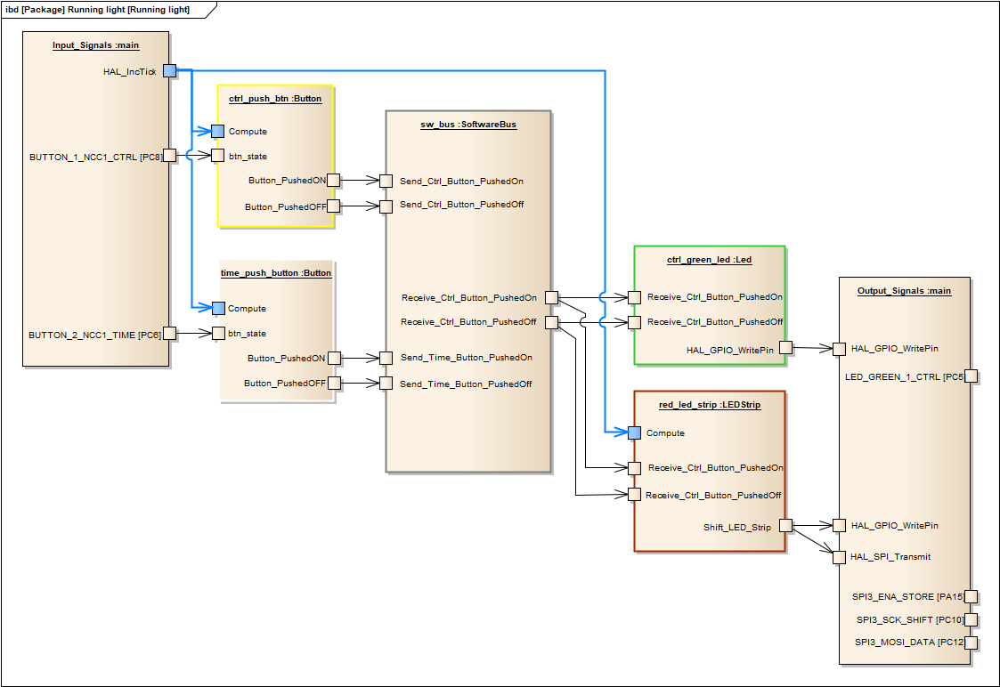

# LED-Runnig_Light
The software using a 74HC595 to drive running lights programs with LEDs. For more information about [74HC595](https://www.arduino.cc/en/uploads/Tutorial/595datasheet.pdf)
read block post [Serial to Parallel Shifting-Out with a 74HC595](https://www.arduino.cc/en/Tutorial/Foundations/ShiftOut). The program runs on a [Nucleo STM32F302R8](https://www.st.com/en/evaluation-tools/nucleo-f302r8.html) board.


### Running lights
 


### Cuircuit diagram
 


### Use cases
- Press the yellow control button
    - WHEN the yellow control button is pressed
    - AND the running light is off
    - THEN the running light begins to execute the next blinking program
    - AND switch on the green LED
    - ELSE the running light is on
    - THEN finish running light
    - AND switch off the green LED
 - Press the white time button
    - WHEN the time control button is pressed
    - THEN decrease the blinking frequency
    - ELSE the threshold was reached
    - THEN increase the blinking frequency
 - Move X axis of the joystick
    - WHEN the joystick is moved in the X direction
    - THEN change the PWM signal of the yellow LED accordingly
 - Move Y axis of the joystick
    - WHEN the joystick is moved in the Y direction
    - THEN change the PWM signal of the red LED accordingly

### Running light software
 


### Dimming light software


## Important files
- **LED_Running_Light.ioc** : STM32CubeMX file for initialization and configuration using a graphical view
- Core/**main.c** : Main file of the program
- LED_Application : folder of the application classes


## Installation and usage

Install the integrated development environment for STM32 microcontrollers.    
[STM32CubeIDE](https://www.st.com/en/development-tools/stm32cubeide.html)

Create a new folder for your STM32 projects, for example 'stm32_workspace' and clone repository
```sh
$ cd <your stm32-workspace folder>
$ git clone https://github.com/embmike/LED-Running-Light.git
```

Then import the software:   
Click File > Import > General > Existing Projects into Workspace > Next > Browse to folder 'LED-Running-Light' > Finish


## Licence
This project is licensed under the terms of the [](https://opensource.org/licenses/MIT)
